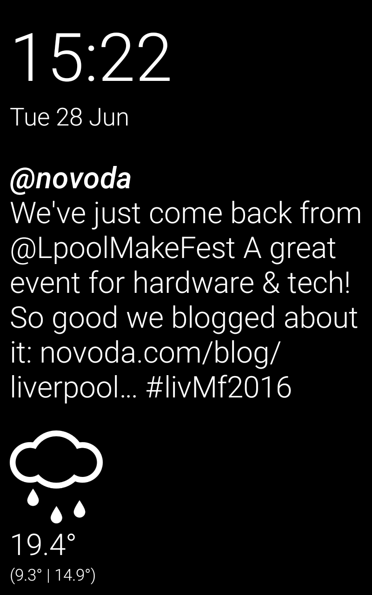
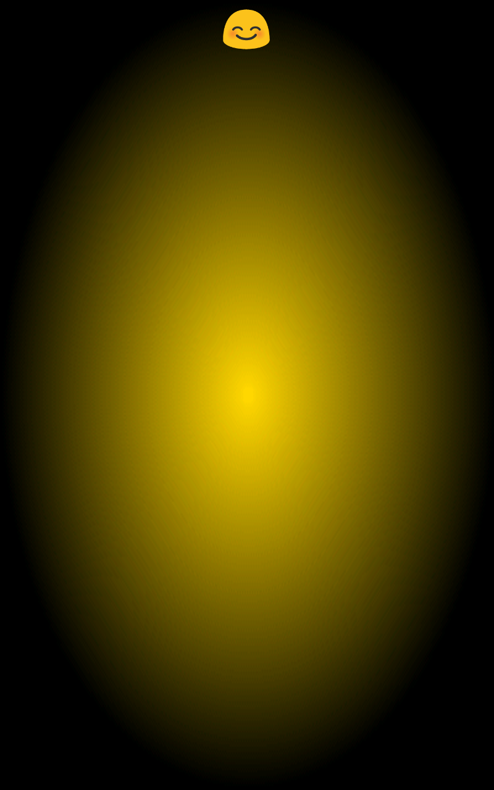

# Magic Mirror
Make your mirror even smarter!
This app is meant to be installed on phones, tablets or TV sticks used in smart mirrors or similar always-on dashboards.

**_As seen at Liverpool MakeFest 2016!_**

##Features
* Time and Date
* Weather forecast for the current day
* Live Tweet updates based on configurable query (by default set to `novoda`)
* Demo TODO list
* Face recognition with smile detector (on a dedicated screen)

##Screenshots
| Info screen | Loking for face | Face sad | Face neutral | Face happy | Face oh-my-God-so-happy | 
| --- | --- | --- | --- | --- | --- |
| | | | | | |

##TODO
* Use the actual coordinates of the device for weather forecast (now set to Liverpool)
* Apply a switch between TODO-list display and Tweet feed
* More animations for the different face emotions

##Development
In order to use all the features of the app, when building it from source, please make a copy of the `gradle.properties.example` file, rename it to `gradle.properties` and add the required keys.

