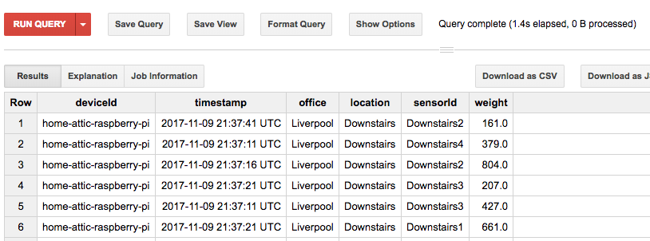
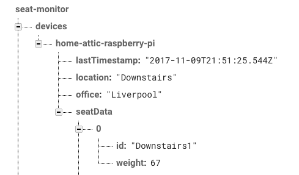

This module contains cloud functions

### receiveTelemetry

Subscribes to the pub/sub of the `meeting-room-device` IoT device appending the data into big query

It also updates a snapshot of the latest data into Firebase realtime database

