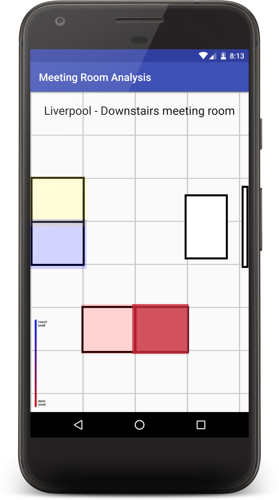

### companion-app

This module is the Android application that will run on a compatible Android phone.

With this application you can see the data collected and have that represented as a heatmap ontop of a blueprint of the meeting room.

The time frame for heat data is configured serverside for now. Meaning you can see the rolling average of seat use over the entire time the sensors have been installed.

The companion app is very much an MVP, but further features could:

- Cross-correlate seat data with meeting calendar data to ensure correct room bookings
- Find a free meeting room with nobody sitting in it (even when booked)
- Show a list of all seats across all rooms and sort by popularity
- View heat map data for a given timeframe
- See real time data collection rather than just aggregated
- Configure the meeting-room-device, to select naming, ids etc

